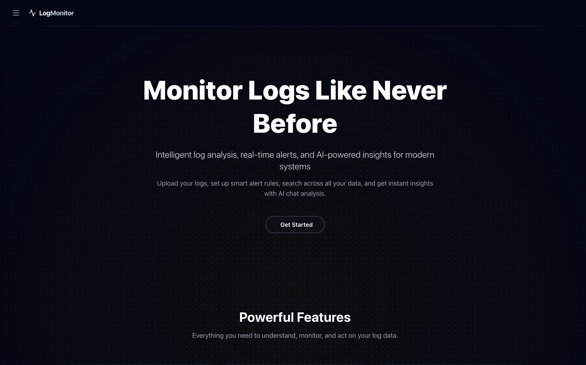
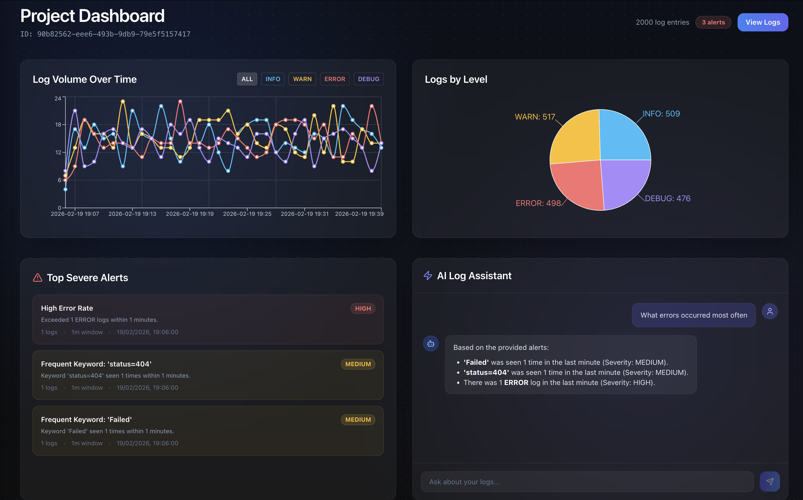
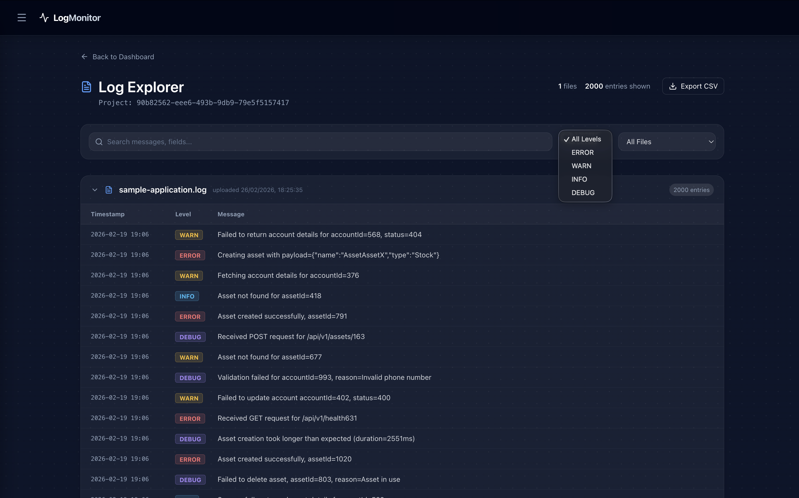
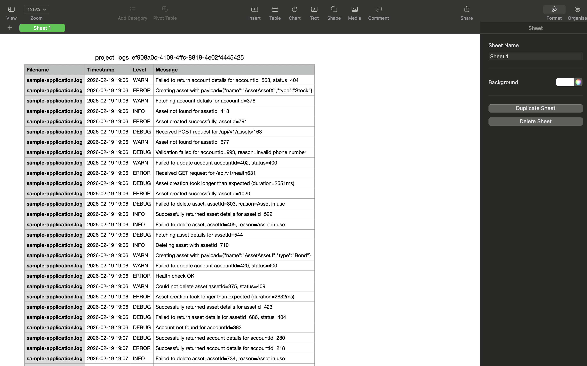

# Automated Log Analysis System

An advanced, AI-driven SaaS platform designed to ingest, parse, and monitor application logs at scale. The system provides real-time alerting, dynamic visualizations, and a state-of-the-art **RAG (Retrieval-Augmented Generation) AI assistant** to interactively diagnose anomalies in your logs.

## 📸 Screenshots

| Landing Page | Dashboard |
| --- | --- |
|  |  |

| Projects View | Log Explorer |
| --- | --- |
|  |  |

| CSV Export |
| --- |
|  |

## 🚀 The SaaS Architecture

We developed this platform as a complete multi-tenant Software-as-a-Service, focusing on security, performance, and user experience.

- **Multi-tenant Core & Authentication**: Users register safely via JWT-based auth. Every log uploaded is isolated using secure UUIDv4 project mappings, completely preventing URL enumeration and data bleed.
- **Data Ingestion & Parsing**: The backend efficiently processes uploaded `.log` files, running regex-based parsing to extract timestamps, services, severities (INFO/WARN/ERROR/DEBUG), and message content. It handles upserts natively to avoid duplicates.
- **Vector Search & AI RAG Pipeline**: 
  - Parsed logs and high-severity alerts are vectorized using Hugging Face embedding models.
  - Embeddings are pushed into **MongoDB Atlas Vector Search**, enabling lightning-fast semantic querying.
  - A generative Hugging Face LLM acts as the "AI Log Assistant", allowing users to ask natural language questions (e.g., *"Why did my database connections timeout?"*) and receiving context-aware, Markdown-rendered diagnoses based purely on their own uploaded project data.
- **Deterministic Alert Engine**: The system continuously evaluates incoming logs across rolling time windows. If certain thresholds are reached (e.g., "6 ERROR logs within 10 minutes" or specific "404 keywords"), it automatically triggers and persists alerts with calculated severities (HIGH, MEDIUM, LOW).

## 🛠 Tech Stack

### Frontend (Client-side)
- **Framework**: React with Vite
- **Routing**: `@tanstack/react-router` for robust, type-safe file-based routing.
- **Styling & UI**: Tailwind CSS for rapid styling, featuring premium "glassmorphic" aesthetics, dynamic gradients, and animated components. `lucide-react` for iconography.
- **Data Visualization**: `recharts` to render real-time Line charts (Log Volume over time) and Pie charts (Logs by level).
- **Markdown Rendering**: `react-markdown` to natively render complex, structured responses from the AI Assistant.

### Backend (Server-side)
- **Framework**: Python / Flask, utilizing modern `uv` dependency management.
- **Database**: MongoDB (via `pymongo`) handling document storage, upserts, and advanced compound indexes (user + project + filename) to maintain tight data integrity. 
- **Security**: Granular `@require_auth` decorators and JWT payload validations securing API routes.

#### Backend Directory Structure
The architecture is modularly separated by concern:
- **`app/routes/`**: Flask Blueprint endpoints containing the entry points for the API (e.g. `/api/auth`, `/api/project`). 
- **`app/services/`**: Core business logic. 
  - The **`project_service.py`** dictates the flow of project creation, and calls parsers to process files.
  - The **`alert_engine.py`** continuously evaluates sliding time-windows across parsed logs to emit rule-based anomalies.
- **`app/parsers/`**: Handles raw text tokenization. `log_parser.py` uses Regex logic to break raw lines into structured metadata (Timestamp, Level, Service).
- **`app/models/`**: Provides the data layer wrapper. Abstracts MongoDB queries (insert, upsert, count) into robust repository classes over specific collections.
- **`app/rag/`**: Contains the Retrieval-Augmented Generation context logic. Prepares prompts injected with recent logs/alerts to query HuggingFace APIs for the AI assistant.

## ✨ Key Features

1. **Intelligent Project Dashboard**: 
   A high-end interface summarizing log entries, active alerts by severity, and time-series log volume charts.
2. **Conversational AI Log Assistant**: 
   A chat panel directly embedded in the dashboard. The RAG architecture intercepts user questions, retrieves the most mathematically relevant alerts via Vector Search, and streams a conversational, highly accurate response.
3. **Log Explorer**: 
   A dedicated `/project-logs` interface where developers can comb through raw parsed data. Includes deep-dive filtering via Keywords, Severity Levels, and specific uploaded log files.
4. **Resilient Data Processing**: 
   Re-uploading the same file gracefully overwrites old data without duplicating, thanks to intelligent backend UPSERT operations.

## 🔧 Getting Started

### Prerequisites
- Python 3.10+
- Node.js & npm
- MongoDB (Atlas recommended if using Vector Search features)
- Hugging Face API Token

### Setup the Backend
1. Navigate to the `/backend` directory.
2. Ensure your `.env` contains:
   ```env
   MONGODB_URI=your_mongo_uri
   MONGODB_DB=your_db_name
   JWT_SECRET=your_jwt_secret
   HF_TOKEN=your_huggingface_token
   ```
3. Run the development server using `uv`:
   ```bash
   uv run main.py
   ```

### Setup the Frontend
1. Navigate to the `/frontend` directory.
2. Install dependencies:
   ```bash
   npm install
   ```
3. Start the Vite development server:
   ```bash
   npm run dev
   ```
4. Access the client at `http://localhost:3000`.

---
*Built focusing on modern aesthetics, solid multi-tenant security, and bleeding-edge RAG infrastructure.*
